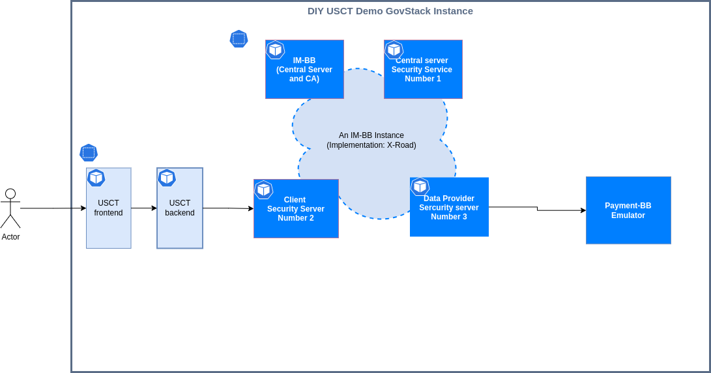

# How to deploy USCT use case to minikube 




This is minimal version of USCT with only X-Road as BB and payment emulator.

High overview located in [Sandbox documentation](https://govstack.gitbook.io/sandbox/access-demos/diy/usct-diy-version).

## Prerequisites 

* [minikube](https://minikube.sigs.k8s.io/docs/)
* [Docker](https://www.docker.com/)
* [Helm charts](https://helm.sh/docs/topics/charts/)

[//]: # (todo)
[//]: # Take a look on default disck size in minikub.
[//]: # It needs around 40 GBi

[//]: # Update main file. Explain from Minikube prospective

## Installation 
1. Pull the [helm chart](./../use-case-helm).
2. Use next commands to up and run application.

```shell
helm install mock-sris ./diy-helm/ --create-namespace --namespace mock-sris
```

```shell
helm upgrade --install mock-sris ./diy-helm/ --create-namespace --namespace mock-sris
```

```shell
helm uninstall mock-sris --namespace mock-sris
```


3. Port forward UI of the Security Server 3 (aka Provider Security Server)

``` shell
kubectl port-forward \
    -n usct \
    service/ss3 4000 4000
```

4. Navigate to 'Clients' tab and press 'Add subsystem' button. 
5. Fill 'Payment' name as Subsystem Code. 
6. Press Yes in Register client popup window. 
7. Go into new 'PAYMENT' subsystem 
8. Click on 'Services' tub. 
9. Press 'Add REST' button. 
10. Choose 'OpenAPI 3 Description' option 
11. Fill 'http://payment-bb-emulator.usct.svc.cluster.local:8080/v3/api-docs' into URL placeholder and 'api' into Service Code. 
12. Enable a new created service --> click on the related switch. 
13. Expand a new created REST definition 
14. Press 'Add subjects' in the 'Service Parameters' tab 
15. Press 'Search' button 
16. Check 'Client' and 'Provider' checkboxes and press 'Add selected' 
17. Close popup


Current set include X-road set:

1. Central server
2. Security server management (for connecting to the central server)
3. Security server for clients
4. Security server for Providers.